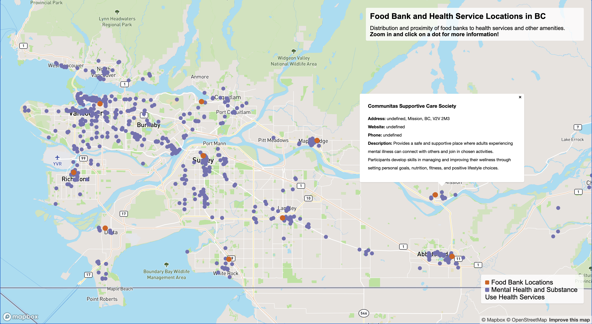

# Lab 1 - Web Cartography

This map shows the distribution of Food Banks and Health Service Locations in the province of British Columbia.

## Map Excerpt:


## Final Map:
[Full Map](472_Lab1.html)
<iframe src="472_Lab1.html" height = '300' width="600"></iframe>


## Reflective analysis:

This map was designed and intended for use by the homeless/people in need, social work volunteers, and city planners. 

It is often assumed only the homeless or low-income individuals access food-banks, and many are ill or substance users. This map hopes to provide information for those in need and those who want to help and attempts to highlight the issue of geographical discrimination or generalization associated with the surrounding community for researchers and city planners. The distribution in this map shows sparse food banks surrounded by multiple mental health and substance use centres. This distribution pattern can further confirm and disseminate geographical stereotypes.

The base map was kept relatively simple with road and place labels for navigation use. Details increase as the user zooms in as not to overcrowd the map at lower levels of zoom. Another effort to de-clutter the map was to change the POI (Point of Interest) density by category based on what I thought was appropriate. I increased the density of essential services and decreasing those of entertainment and other unrelated categories.
At the same zoom level and symbol size, the purple circles looked larger than the orange circles. So the orange circles were made larger to balance the difference in size perception. The colours orange and purple create visual contrast between the categories and against the base-map. 
Popups are activated if the user clicks on a circle, which provides detailed information on the address, website, phone number, and description for the facilities, if available in the GeoJSON.

Future improvements for this map include completing the original GeoJSON file since some facilities have incomplete fields. The map can become more useful with more integration of amenities for people in need, such as temporary housing, soup kitchens, legal support, thrift stores and more. A quick search found that compiled datasets are unavailable or not open-source for these amenities. 

## Critque on the Map's first draft (Changes have been made and relfected in analysis) :
```
undefined
Ashcroft , BC , V0K 1A0
website: undefined
Phone: undefined
```
* I like how it says "website: undefined". What is undefined in the first line?
* the black is nice but its a bit stark
* the red (now orange) circles are bigger which makes me think they are more important than the black (now purple) ones
* Food and mental health is actually super accessible, but other things like dental, law, are not.
* what is the purpose of this map? 
  * It is hard to draw the connection between the two variables.
  * consider the experience of the person viewing this - is it for someone who is experiencing homelessness or for research purposes and community volunteers looking to help people expereincing homelessness?

## Data Sources

Ministry of Health. (2021). Mental Health and Substance Use Health Services [GeoJSON]. Retrieved from https://catalogue.data.gov.bc.ca/dataset/mental-health-and-substance-use-health-services#edc-pow

Ministry of Forests, Lands, Natural Resource Operations and Rural Development. (2021). Food Banks  [GeoJSON]. Retrieved from https://catalogue.data.gov.bc.ca/dataset/food-banks#edc-pow 

